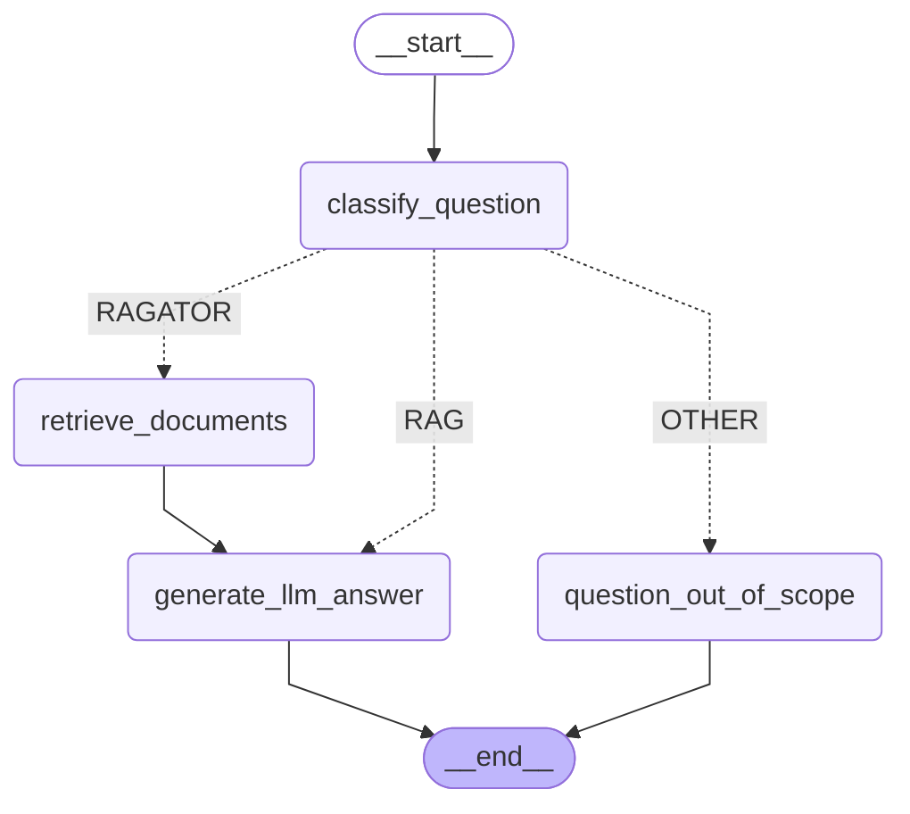

# ragator-v2

### RAG diagrams

<!-- RAGATOR_DIAGRAM_START -->

```mermaid
---
config:
  flowchart:
    curve: linear
---
graph TD;
	__start__([<p>__start__</p>]):::first
	classify_question(classify_question)
	question_out_of_scope(question_out_of_scope)
	retrieve_documents(retrieve_documents)
	generate_llm_answer(generate_llm_answer)
	__end__([<p>__end__</p>]):::last
	__start__ --> classify_question;
	generate_llm_answer --> __end__;
	question_out_of_scope --> __end__;
	retrieve_documents --> generate_llm_answer;
	classify_question -. &nbsp;RAGATOR&nbsp; .-> retrieve_documents;
	classify_question -. &nbsp;RAG&nbsp; .-> generate_llm_answer;
	classify_question -. &nbsp;OTHER&nbsp; .-> question_out_of_scope;
	classDef default fill:#f2f0ff,line-height:1.2
	classDef first fill-opacity:0
	classDef last fill:#bfb6fc

```
<!-- RAGATOR_DIAGRAM_END -->
