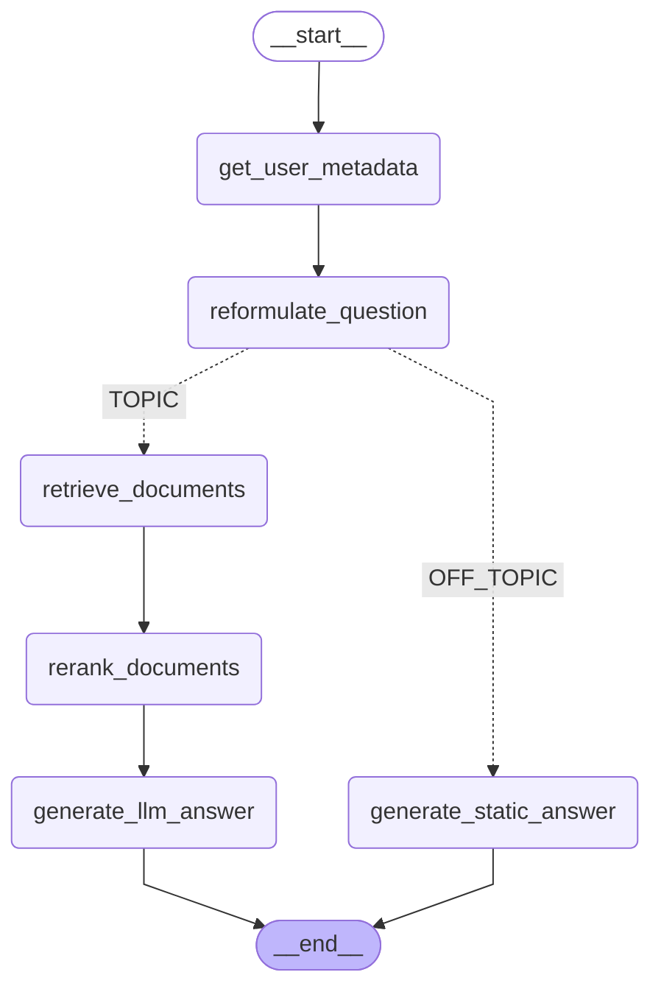

# ragator-v2

### Rag Graph

```mermaid
---
config:
  flowchart:
    curve: linear
---
graph TD;
        __start__([<p>__start__</p>]):::first
        get_user_metadata(get_user_metadata)
        reformulate_question(reformulate_question)
        generate_static_answer(generate_static_answer)
        retrieve_documents(retrieve_documents)
        rerank_documents(rerank_documents)
        generate_llm_answer(generate_llm_answer)
        __end__([<p>__end__</p>]):::last
        __start__ --> get_user_metadata;
        generate_llm_answer --> __end__;
        generate_static_answer --> __end__;
        get_user_metadata --> reformulate_question;
        rerank_documents --> generate_llm_answer;
        retrieve_documents --> rerank_documents;
        reformulate_question -. &nbsp;OFF_TOPIC&nbsp; .-> generate_static_answer;
        reformulate_question -. &nbsp;TOPIC&nbsp; .-> retrieve_documents;
        classDef default fill:#f2f0ff,line-height:1.2
        classDef first fill-opacity:0
        classDef last fill:#bfb6fc

```
